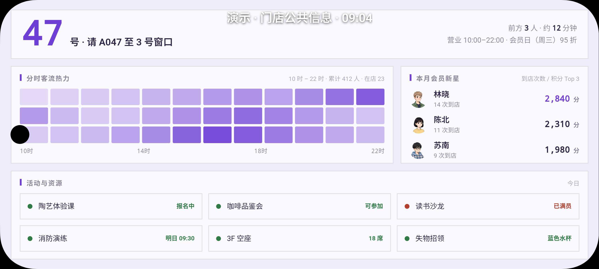
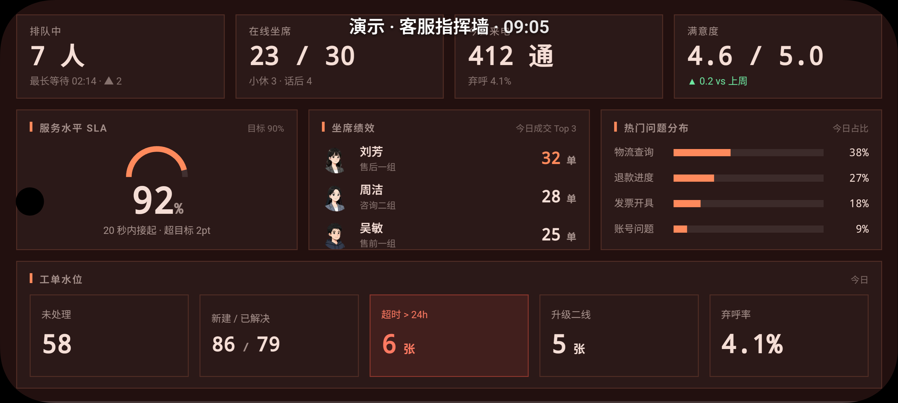

# Skills

个人 Agent Skills 统一目录。所有 skill 都遵循 [Agent Skills](https://agentskills.io) 规范（含 `SKILL.md`），可通过 [`npx skills add`](https://skills.sh) 安装到 Claude Code、Codex、Cursor 等 75+ Agent。

## 安装

```bash
# 交互式安装本仓库的 skill（会列出全部 11 个供选择）
npx skills add easychen/skills

# 只装某一个
npx skills add easychen/skills --skill sudoboard
npx skills add easychen/skills --skill serverchan
npx skills add easychen/skills --skill opc-orchestrator

# 装全部
npx skills add easychen/skills --skill '*' -y
```

### Claude Code 插件 Marketplace 方式

本仓库带有 `.claude-plugin/marketplace.json`，因此也可以作为 Claude Code 插件市场使用：

```text
# 在 Claude Code 里执行
/plugin marketplace add easychen/skills
/plugin install sudoboard@easychen-skills
/plugin install serverchan@easychen-skills
/plugin install opc@easychen-skills
```

marketplace.json 里逐个声明了 skill 路径，`skills` CLI 与 Claude Code 都会按清单精确发现，不依赖目录层级约定。

## 目录结构

```
skills/
├── sudoboard/      # SudoBoard 数据看板
├── serverchan/     # Server 酱消息推送
├── opc/            # OPC 一人公司方法论（9 个子 skill）
├── assets/         # README 截图
└── .claude-plugin/marketplace.json   # Claude Code 插件市场清单
```

## Skill 索引

### sudoboard

- **官网**：<https://sudo.ft07.com/>
- **目录**：[`sudoboard/`](./sudoboard/)
- **说明**：为当前项目创建 SudoBoard 数据看板（可视化数据面板 / 电视大屏）。SudoBoard 把电视大屏变成"数据落地页"：Agent 负责配置数据源、编写 JSX 展示模板，在本地生成高保真 HTML 预览并打开浏览器迭代；确认后一键部署——同步到 SudoBoard App（局域网设备，适合挂在办公室/门店电视上），或直接部署到 Cloudflare（自带后端，连 App 都不用装）。内置 ECharts 图表、多主题（浅色/深色）、自动刷新与轮播，适合门店信息屏、客服指挥墙、团队 KPI 大屏、排队叫号屏等场景。

| 门店信息屏（浅色主题） | 客服指挥墙（深色主题） |
|---|---|
|  |  |

### serverchan

- **目录**：[`serverchan/`](./serverchan/)
- **来源**：[easychen/serverchan-skill](https://github.com/easychen/serverchan-skill)
- **说明**：通过 Server 酱（方糖）向微信/App 推送消息通知，支持标题、Markdown 正文及 tags/short/channel 等可选参数，自动识别 SCT / SC3 SendKey。

### opc（一人公司方法论）

- **目录**：[`opc/`](./opc/)
- **来源**：[easychen/opc-methodology](https://github.com/easychen/opc-methodology) 的 `skills/` 目录
- **子 skill**：

| Skill | 说明 |
|---|---|
| [`opc-orchestrator`](./opc/opc-orchestrator/) | 编排完整的一人公司工作流，串联所有 OPC skill |
| [`opc-niche-positioning`](./opc/opc-niche-positioning/) | 市场测绘 + 客户素描，寻找并定位利基市场 |
| [`opc-value-proposition`](./opc/opc-value-proposition/) | 为候选客群设计价值主张并选出最优方案 |
| [`opc-business-model-design`](./opc/opc-business-model-design/) | 精益画布 + 简化商业模式画布设计商业模式 |
| [`opc-mvp-designer`](./opc/opc-mvp-designer/) | 定义最小可行实验与 MVP |
| [`opc-conversion-loop`](./opc/opc-conversion-loop/) | 设计从触达、获客到成交的转化循环 |
| [`opc-asset-ops`](./opc/opc-asset-ops/) | 把可重复产出转化为可复利的资产 |
| [`opc-dashboard-review`](./opc/opc-dashboard-review/) | 轻量指标复盘经营健康度与瓶颈分析 |
| [`opc-resource-audit`](./opc/opc-resource-audit/) | 8 大类盘点创始人资源 |

## 新增 Skill

把新的 skill 目录（含 `SKILL.md`，frontmatter 至少要有 `name` 和 `description`）放进本仓库根目录或对应分组目录，然后：

1. 在上面的索引里加一行；
2. 在 `.claude-plugin/marketplace.json` 的 `plugins` 里登记（新建分组时）或往对应分组的 `skills` 数组里加路径。

改完可以本地验证：`npx skills add . --list`。
